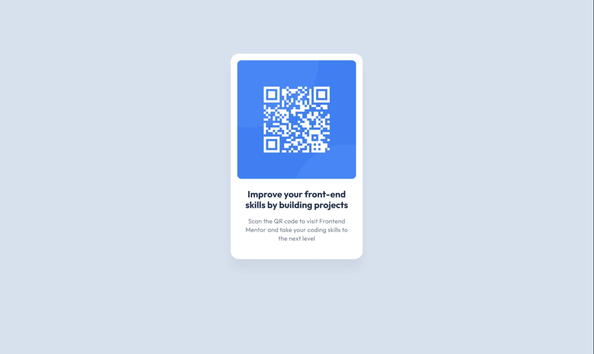
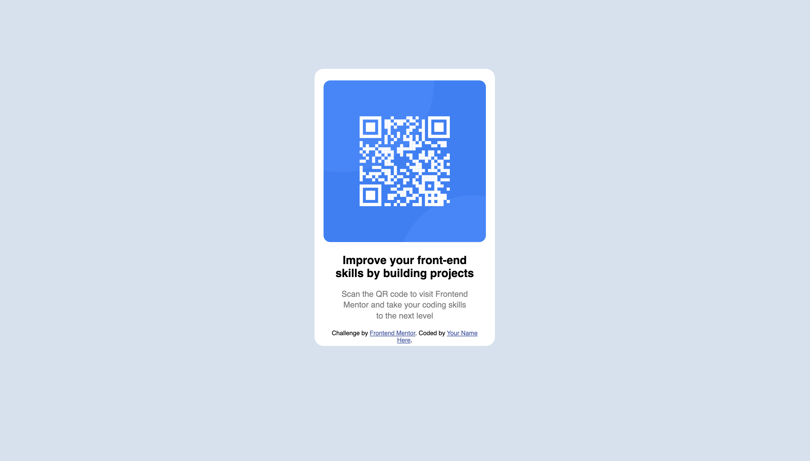

# QR Code Component – Frontend Mentor Challenge

This is my solution to the **QR Code Component Challenge** on [Frontend Mentor](https://www.frontendmentor.io/). It’s a simple, clean component built to practice core layout and styling fundamentals with HTML and CSS.

## 📸 Original Image

## 📸 Cloned Image

## 🛠️ Tech Stack

- Semantic HTML5  
- Pure CSS  
- Google Fonts  
- Desktop-First Design  

## 📚 What I Learned

- How to structure a basic card component using HTML/CSS
- Improved confidence with div centering and padding/margin spacing
- Fine-tuned border-radius values for visual polish

## 🚀 Getting Started

1. Clone this repo  
2. Open `index.html` in your browser  
3. That’s it—clean, standalone frontend component

## 🎯 Challenge Info

This is a [Frontend Mentor Challenge](https://www.frontendmentor.io/learning-paths/getting-started-on-frontend-mentor-XJhRWRREZd/steps/66d005903c19191dc30f1dfb/challenge/start), designed to help developers practice HTML and CSS.

## 💪 Author

Built by [Your Name](https://github.com/yasojan)  
